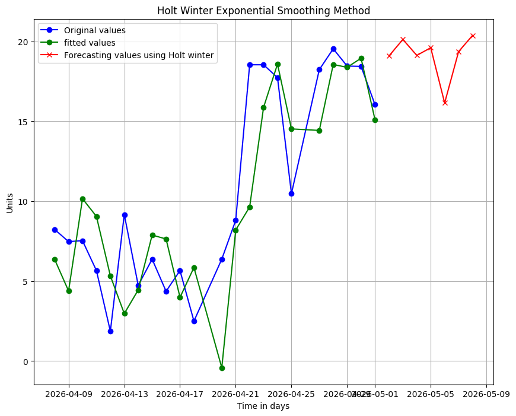
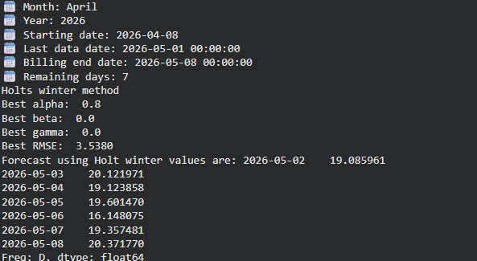

# Intelligent Household Energy Forecasting

A smart energy consumption forecasting system that **automatically selects the best forecasting model** based on how much data is available — built with Python on Google Colab for real-world IoT energy data.

---

## What Makes This System Different

Most forecasting projects pick one model and apply it to all data. This system is smarter — it **adapts the model to the data size**:

- Only 7 days of data? → Use **Simple Exponential Smoothing (SES)**
- 8 to 20 days? → Use **Holt's Double Exponential Smoothing** (captures trend)
- 30+ days? → Use **Holt-Winters Triple Exponential Smoothing** (captures trend + seasonality)

This means the system gives the most accurate possible forecast regardless of how far into the billing month you are.

---

## What It Does

- Reads raw IoT energy CSV files and preprocesses minute-level data into daily aggregates
- Detects and corrects sensor failures using a **rolling median anomaly filter**
- Automatically selects the right forecasting model based on available data
- Finds the **best hyperparameters** (alpha, beta, gamma) through grid search to minimize error
- Forecasts remaining days of the billing month
- Reports units consumed so far, forecasted units, and total monthly projection
- Automatically picks the **latest CSV file** from a folder — no manual file selection needed
- Generates plots for each model showing original, fitted, and forecasted values

---

## Demo





---

## Forecasting Pipeline (How It Actually Works)

```
Raw IoT CSV file (minute-level energy readings)
        ↓
Parse timestamps → resample to daily aggregates
        ↓
Clean data:
  → Remove zero-consumption days
  → Remove last incomplete day
  → Detect sensor spikes via rolling median (window=7, threshold=2.5x)
  → Replace anomalies with rolling median values
        ↓
Determine available data length
  → ≤ 7 days   → Simple Exponential Smoothing (SES)
  → 8–20 days  → Holt Double Exponential Smoothing (damped trend)
  → 30+ days   → Holt-Winters Triple Exponential Smoothing (trend + seasonality)
        ↓
Grid search for best hyperparameters (minimize MSE/RMSE)
        ↓
Forecast remaining billing days
        ↓
Report: units consumed + forecasted units + total monthly projection
```

---

## Model Details

### Simple Exponential Smoothing (SES)
- Used when: ≤ 7 days of data
- Grid search: `alpha` from 0.1 to 0.9
- Metric: MSE (minimized)
- Best for: flat/stable consumption with no trend

### Holt Double Exponential Smoothing
- Used when: 8–20 days of data
- Grid search: `alpha` (0.1–0.9), `beta` (0.01–0.49), `damping` (0.80, 0.85, 0.90, 0.95, 0.98)
- Metric: MSE (minimized)
- Best for: consumption with an upward or downward trend

### Holt-Winters Triple Exponential Smoothing
- Used when: 30+ days of data
- Grid search: `alpha` (0.1–0.9), `beta` (0.01–0.49), `gamma` (0.01–0.49)
- Damping slope fixed at 0.92, seasonal periods = 5
- Metric: RMSE (minimized)
- **Best result: RMSE = 3.538** (alpha=0.8, beta=0.0, gamma=0.0)
- Best for: consumption with trend + weekly seasonality

---

## Results

| Model | Best Parameters | Error |
|---|---|---|
| Simple Exponential Smoothing | alpha = optimized per run | MSE minimized |
| Holt Double Exponential | alpha, beta, damping = grid searched | MSE minimized |
| Holt-Winters Triple | alpha=0.8, beta=0.0, gamma=0.0 | **RMSE = 3.538** |

Sample forecast output (April 2026, 7 remaining days):
```
🗓️ Month: April
🗓️ Starting date: 2026-04-08
🗓️ Last data date: 2026-05-01
🗓️ Billing end date: 2026-05-08
🗓️ Remaining days: 7
Holt-Winters method selected

🗓️ Units consumed so far: 234.73
🗓️ Forecasted units:      133.81
🗓️ Total monthly units:   368.54
```

---

## Tech Stack

| Technology | Purpose |
|---|---|
| Python 3 | Core language |
| Pandas | Data loading, resampling, time series handling |
| NumPy | Numerical operations, grid search |
| statsmodels | SES, Holt, Holt-Winters models |
| scikit-learn | MSE/RMSE evaluation |
| Matplotlib | Forecast visualization |
| Google Colab | Development environment |
| Google Drive | IoT data storage and access |

---

## Project Structure

```
intelligent-household-energy-forecasting/
│
├── energy_forecasting.ipynb     → Complete notebook (all models + pipeline)
├── assets/
│   ├── forecast_graph.png       → Holt-Winters forecast plot
│   ├── remaining_days.png       → Billing summary output
│   └── monthly_summary.png      → Monthly consumption breakdown
└── README.md
```

---

## How To Use

### Option 1 — Google Colab (Recommended)

1. Open the notebook in Google Colab
2. Mount your Google Drive:
```python
from google.colab import drive
drive.mount('/content/drive')
```
3. Upload your energy CSV files to a Drive folder
4. Update the folder path and date range at the bottom of the notebook:
```python
watch_and_predict(
    "/content/drive/MyDrive/YOUR_FOLDER",
    start_date_str="2026-04-08",
    last_date_str="2026-05-11"
)
```
5. Run the cell — the system picks the latest CSV automatically

### Option 2 — View Full Notebook

GitHub truncates large notebooks in preview. To view the complete notebook with all outputs:

> 📓 [View full notebook on nbviewer](https://nbviewer.org/github/techgreetings/intelligent-household-energy-forecasting/blob/main/energy_forecasting.ipynb)

---

## CSV Data Format

Your energy CSV file must have these two columns:

| Column | Format | Description |
|---|---|---|
| `time_stamp` | datetime string | Timestamp of the reading |
| `units` | float | Energy units consumed |

---

## Sensor Anomaly Detection

The system automatically handles sensor failures and spikes:

```python
rolling_median = day_level_data.rolling(window=7, min_periods=1).median()
sensor_failure_mask = day_level_data > rolling_median * 2.5
day_level_data[sensor_failure_mask] = rolling_median[sensor_failure_mask]
```

Any day consuming more than **2.5x the 7-day rolling median** is flagged as a sensor spike and replaced with the median value — keeping forecasts reliable even with faulty IoT sensors.

---


## ⚠️ Known Limitations

- **Data Dependency**: Holt-Winters requires sufficient data (ideally 2+ seasonal cycles). Performance may degrade with very small datasets (<30 days).

- **Fixed Seasonal Parameter**: The seasonal period is currently set to 5 (assumed weekly pattern), which may not generalize well across different usage patterns or regions.

- **Cold Start Problem**: Forecast accuracy is limited in early stages when only a few days of data (e.g., 7–8 days) are available.

- **Data Quality Sensitivity**: Although anomaly handling is implemented, extreme noise, prolonged missing data, or irregular consumption behavior can still impact forecast reliability.

- **Limited Generalization**: The model has been tested on a single household dataset and may require further validation for broader deployment.

- **Manual Configuration**: File paths (e.g., Google Drive) and input parameters must be manually updated, limiting automation and scalability.

- **Model Scope Limitation**: The current system relies on Exponential Smoothing techniques due to initial data scarcity. As more data becomes available, transitioning to more advanced models such as **ARIMA, SARIMA, or LSTM** is expected to improve forecasting accuracy and capture complex temporal patterns.

---

## Author

Built by **Muhammad Ibrahim**
ML Engineer Intern | BSCS Student
GitHub: [github.com/techgreetings](https://github.com/techgreetings)
LinkedIn: [linkedin.com/in/muhammad-ibrahim-techgreetings](https://linkedin.com/in/muhammad-ibrahim-techgreetings)
